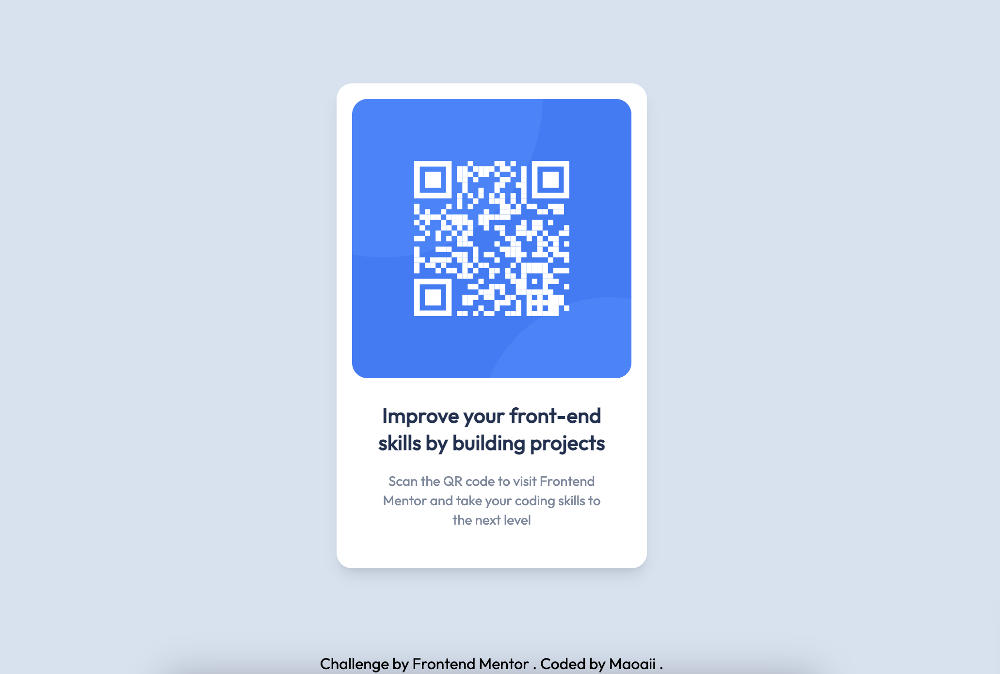

# Frontend Mentor - QR code component solution

This is a solution to the [QR code component challenge on Frontend Mentor](https://www.frontendmentor.io/challenges/qr-code-component-iux_sIO_H). Frontend Mentor challenges help you improve your coding skills by building realistic projects. 

## Table of contents

- [Overview](#overview)
  - [Screenshot](#screenshot)
  - [Links](#links)
- [My process](#my-process)
  - [Built with](#built-with)
  - [What I learned](#what-i-learned)
- [Author](#author)

## Overview

### Screenshot

- Desktop View:

 

 
 

- Mobile View

 

### Links

- [Solution](https://github.com/Maoaii/QR-Code-Frontend-Mentor)
- [Live Site](https://maoaii.github.io/QR-Code-Frontend-Mentor/)

## My Process

### Built with

- Semantic HTML5 markup
- [Tailwind](https://tailwindcss.com/) - Tailwind CSS
- Flex
- CSS Grid
- [Google Fonts](https://fonts.google.com/) - For fonts

### What I learned

It was the first time I used Tailwind CSS so it was really fun! Aside from learning how to set up Tailwind, I also learned a bit more about the `flex` property in CSS.

### Useful resources

- [CSS Flex](https://css-tricks.com/snippets/css/a-guide-to-flexbox/) - css-tricks has been an awesome resource to learn anything regarding CSS. Can't recommend enough.

## Author

- Website - [Lucas Girotto](https://maoaii.github.io/Resume_Website/)
- Frontend Mentor - [@Maoaii](https://www.frontendmentor.io/profile/Maoaii)
